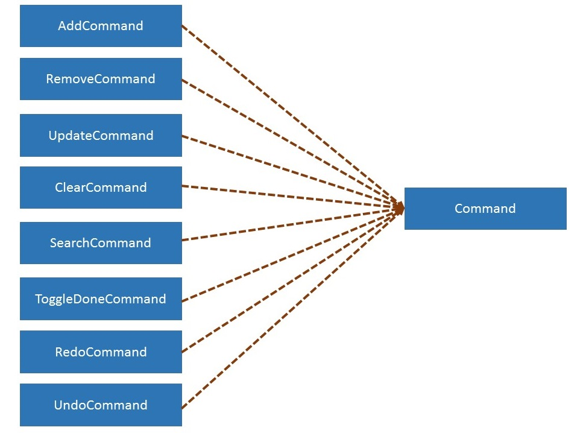

# About
Tempo is a simple Calendar tool for users to organise their events and tasks. It is a Java application that operates both with a GUI and command-prompt based Text User Interface.

If you are interested in contributing to the further development of Tempo, this guide will help you understand how it works. We have organized this guide in a top-down manner so that you can understand the design of Tempo before going down to the details of its implementation.

# Table of Contents
<!-- MarkdownTOC -->
- [Architecture](#architecture)
- [UI component](#ui-component)
    - [`TUI` Package](#tui-package)
		-[`Tempo` class](#tempo-class)
	-[`GUI` Package](#gui-package)
- [Logic Component](#logic-component)
    - [`RequestHander` Class](#requesthandler-class)
    - [`CommandParser` Class](#commandparser-class)
	- [`Command` and `Result` Classes](#commandandresult-classes)
		- [`Command` Class](#command-classes)
		- [`Result` Class](#result-classes)
	- [`Calendar` Class](#calendar-class)
		-[`Undo/Redo` Functionalities](#undo-redo-functionalities)
	- [`Display` Class](#display-class)
	- [`IndexStore` Class](#indexstore-class)
	- [`CurrentTime` Class](#currenttime-class)
- [Data Component](#logic-component)
    - [`Event`, `Task`, `FloatingTask` (`CalendarObject`) Classes](#calendarobject-class)
- [Storage Component](#storage-component)
    - [`CalendarImporter` Class](#calendarimporter-class)
    - [`CalendarExporter` Class](#calendarexporter-class)

<!-- /MarkdownTOC -->

# Architecture

> Figure 1: Top-level design of Tempo 

Tempo is made up of 5 main components: <br>
1. User Interface (UI) component  provides a platform (GUI based and Command Line Interface based) for users to interact with the application and perform the functionalities of Tempo
2. The logic component contains all logic required to parse user’s commands and execute them.
3. 	The data component contains objects involved in the representation of the user’s data during program run-time.
4. 	The storage component acts as the main handler between the logic component and the text file

After understanding the top-level design, we can take a deeper look into Tempo in terms of its classes.


> Figure 2: Breakdown of Tempo’s Classes According to their Components


#### Relationship Between Classes and their Logical Components
Component Name | Classes
----------- | ----------------------
`UI` | `Tempo`</font>
`Logic` | `RequestHandler` Class <br/> `CommandParser` class<br/>`Calendar` class<br/>`IndexStore` class<br/>`Display` class<br/>`CurrTime` class<br/>`Command` and `Result` classes<br/>
`Data` | `Event`class<br/>`Task` class<br/> `FloatingTask` class
`Storage` | `CalendarImporter` class <br/> `CalendarExporter` class

More extensive description of the functionalities of the classes are detailed as follow.

#UI component
The UI component provides the main interaction interface for Tempo. It comprises of 2 packages: The TUI and the GUI. These components will interact with the `Logic` component to perform Tempo's core functionalities.
##  TUI Package
The TUI package of only one class, Tempo. It aims to provide users with an entry point into Tempo from the Command Line Interface (CLI). 
### `Tempo` class

The `Tempo` class is the main entry/exit point for users in Tempo. from the Command Line Interface (CLI) It is responsible for reading inputs from the CLI and passing them to the RequestHandler class in the Logic component to handle. Upon receiving the Result of the input, Tempo is also responsible for displaying the appropriate output based on the Result.


``` java
while (run) {
	Result result = listenForInput();

	if (result.isSuccess()) {
		if (result.isDisplayResult()) {
			System.out.println(result.getCmdPerformed());
		} else {

System.out.println(String.format(SUCCESSFUL_MESSAGE, 
result.getCmdPerformed()));

			if (result.hasWarning()) {
				System.out.println(result.getWarning());
			}
		}
	} else {
		System.out.println(String.format(UNSUCESSFUL_MESSAGE, result.getCmdPerformed()));
		if (result.hasWarning()) {
			System.out.println(result.getWarning());
			}
		}
}
}
						...

private Result listenForInput() {
String input = sc.nextLine();

	if (!input.equals("")) {
		return requestHandler.processCommand(input);

	} else {
		return listenForInput();
	}
}

```

The above code snippet shows how Tempo will listen for an input, pass it to RequestHandler, and then processes the Result returned.

#### Significant Methods
|Return Type | Method Name | Description|
| ------------- |-------------| ----------------|
| `Result` |`listenForInput()`| Listens for input from the CLI and calls `processCommand()` from RequestHandler|


## GUI Package
The graphical interface for Tempo is broken into three sub-components. The launcher, the view, and the controller.

|Category| Class | Description|
| ------------- |-------------| ----------------|
|Launcher|TempoGui|The launcher class uses the JavaFX GUI framework. Its main purpose is to process arguments, and inflate a 	view. We have no arguments, the Tempo Launcher titled (TempoGui.java) launches the view stored in an 	XML file.|
|View|temp.xml|The view is the design of the JavaFx components. It stores what components the user interacts with as well as 	their initial position on the screen. It stores all the unique ids of these components so they can be manipulated 	by the Controller, as well as names of methods that should be called when a certain user event is triggered |
|Controller|Controller.java|The controller handles the logic of changing the state of the UI based on updated changes to the data. It keeps 	track of the data types and data structures of the data being used. |
	
# Logic Component
The Logic component contains the core functionalities of Tempo.  It receives input from the UI component, parses them into Commands, executes the Command and returns the Result of the command executed to the UI component for output.


>Figure 3: Various Classes in Logic Component and their Relationship

At the center of Tempo is the `RequestHandler` class. Its function is to recieve inputs that are passed in by the user and redirect them to `ArgParser` class for processing to obtain the necessary parameters for execution, before redirecting the processed command and parameters to the respective CRUD logic.   

This component consists of 7 core classes namely :
`RequestHandler` Class, `CommandParser` Class, `Calendar` Class, `IndexStore` Class, `Display` Class, `CurrTime` Class
 and finally, the `Command` and `Result` Classes


## `RequestHandler` Class
At the centre of the Logic component is the RequestHandler. The RequestHandler receives input from the UI component, passes them to the CommandParser for parsing, executes the command, and returns the Result of the executed Command back to the UI.


>Figure 4: Sequence diagram Illustrating How an User Input is Being Processed by the Logic Component and the Role of the `RequsestHandler` class.

<b>How `RequestHandler` works:</b>
1. Recieves command string the user
2. Pass the string to `CommandParser` for interpretation
3. Executes the Command object that is returned by the `CommandParser` 
4. Returns the Result of the Command to the UI

#### Significant Methods
|Return Type | Method Name | Description|
| ------------- |-------------| ----------------|
| `String` |`initialize()`| Initializes the `Calendar` for usage|
| `Result` |`processCommand()`| Passes the command string received by the UI to `CommandParser` for parsing. Upon receiving a `Command`object from `CommandParser`, proceeds to `execute()` the `Command`| 

## `CommandParser` Class
The CommandParser is the main interpreter of the user’s input. Its function is to breakdown the command string passed by the RequestHandler and processes them into Command objects for the RequestHandler to execute. In the event that the command that is passed is invalid, the CommandParser will return a null object. 

To allow users to have limited NLP capabilities in putting the dates, the `CommandParser` utilizes the Natty Date Parser Library (http://natty.joestelmach.com/)

<b>How `CommandParser` works:</b>
1. Recieves command string from `RequestHandler` class
2. Interprets the command type and based on the command type, the command string to its respective processing function for processing
3. The processing function will process the rest of the parameters in the command string and generate a Command object.
4. The Command object is then being passed to the RequestHandler for execution

#### Significant Methods
|Return Type | Method Name | Description|
| ------------- |-------------| ----------------|
| `Command` |`parse()`| Determines the type of command that is being called and proceeds to call the various command processing functions.|
| `Command` |`processAddCommand()`<br/>`processRemoveCommand()`<br/>`processUpdateCommand()`<br/>`processDoneCommand()`<br/>`processUndoneCommand()`<br/>`processDisplayCommand()`<br/>`processSearchCommand()`<br/>`processUndoCommand()`<br/>`processRedoCommand()`<br/>`processFilenameCommand()`<br/>`processClearCommand()`<br/>`processHelpCommand()`<br/>`processExitCommand()`<br/>| Command processing functions to parse command string into a `Command` object|

##`Command` and `Result` Classes
### Command Classes


> Figure 5: Various types of Command Classes

The command classes are classes that contains functionalities that invokes other classes (`Calendar` and `Display` classes) that performs Tempo's CRUD functionalities.  

The functionality that they perform is dependent of the type of Command Object they are. In total, Tempo currently has 19 various types of command objects.

The following are the names of the Command object that Tempo supports: 
|Command Object | Functionailty |
| ------------- |-------------| 
|AddCommand|Adding of `CalendarObjects` into `Calendar`|
|RemoveCommand|Removal of `CalendarObject` from `Calendar`|
|UpdateCommand|Updating of `CalendarObjects` in `Calendar`|
|DisplayCommand|Displaying of `CalendarObjects` to CLI (Mainly used by Tempo's TUI)|
|ToggleDoneCommand|Toggles `Task` and `FloatingTask`'s **isDone** parameter|
|SearchCommand|Displays results that matches the current search parameters|
|ClearCommand|Clears the current working text file|
|EditFileNameCommand|Change the current output file to another user specified text file|
|UndoAdd<br/>UndoRemove<br/>UndoUpdate<br/>UndoDone<br/>UndoClear<br/>UndoEditFileName<br/>|Performs Undo Functionailities for the respective commands|
|RedoCommand|Performs Redo Functionality|
|HelpCommand|Displays the Pre-formatted User Guide|
|ExitCommand|Exits Tempo|

### Result Class
The Result class is an object representation of the result of the command that is executed by `RequestHandler` via the `Command`object. It is being returned to the `UI` component for processing of results and displaying the output to the user. 
####Attribute in Result Class
|Attribute|Type|Description|
|----------|----------|-------|
|cmdPerformed|String|To allow UI to know which command string has been executed|
|warning|String|Contains any warning messages (i.e Clashing event dates) that should be displayed to the users| 
|isSuccess|boolean|Allows UI to determine if the command performed has been executed successfully for handling purposes|
|isDiplayResult|boolean|For TUI only: Determines if the Result is a Display Result (the TUI should not print out cmdPerformed if the result is a Display Result) |
|results|HashMap&lt;String,ArrayList&lt;CalendarObject&gt;&gt;|For GUI: Returns the `CalendarObject` results of the command for TempoGui to handle|
	
## `Calendar` Class
The `Calendar` class serves to function as the CRUD logic of Tempo. It is the main runtime data store which contains 3 main collection that stores `Event`, `Task` and `FloatingTask` objects. It is also the class that performs **add**, **remove** and **update** functions on the objects in the collection.

**How  `Calendar` works:**<br/>
**Adding of Event/Task/FloatingTask:**<br/>
1. Requests for next available index number and series index number  from `IndexStore` class.
2.  Using the received index numbers from `IndexStore` as well as the arguments passed in by `RequestHandler`, proceeds to call the constructor for `Event` or `Task` or `FloatingTask`
3. Once the object is created, stores the object in its respective collection
4. Proceed to sort the collection based on chronological order
5. Exports the data in all collections to the user-specified text file using `CalenderExporter` class
 
 
**Removing of Event/Task/FloatingTask:**
1. Requests for item type from `IndexStore` class given the index of the item passed in by `RequestHandler` and calls `removeEvent(int)`, `removeTask(int)` or `removeFloatingTask(int)` accordingly.
2. For each `removeEvent(int)`, `removeTask(int)` and `removeFloatingTask(int)` method, search in the respective collections in `Calendar` class until the item with the given index is found.
3. Remove the item from its collection in `IndexStore` class.
4. Remove the item from its collection in `Calendar` class.
5. Exports the data in all collections to the user-specified text file using `CalenderExporter` class<br/>


**Updating of Event/Task/FloatingTask:**
1. Requests for item type from `IndexStore` class given the index of the item passed in by `RequestHandler` and calls `updateEvent(int)`, `updateTask(int)` or `updateFloatingTask(int)` accordingly.
2. For each `updateEvent(int)`, `updateTask(int)` and `updateFloatingTask(int)` method, search in the respective collections in `Calendar` class until the item with the given index is found.
3. Call the item's class (`Event`, `Task` or `FloatingTask`) to update its parameters.
4. Stores the updated item in its collection in `IndexStore` class.
5. Exports the data in all collections to the user-specified text file using `CalenderExporter` class<br/>

**Removing/Updating of a Recurring CalendarObject**
1. Based on the parameters given, locate the instance of the CalendarObject that `Calendar` is performing the function (remove/update) on.
2. Perform the function on the located CalendarObject 
3. While performing the respective function on the CalendarObject, take note of the seriesIndex of the object.
4. Using a loop, execute the same function of the rest of the CalendarObject which shares the same seriesIndex


###Undo/Redo Functionalities
In order to support Tempo's undo and redo functionalities, 3 LIFO stacks are implemented (`undoHistory`, `redoHistory` and `cmdHistory`).

**Undo**
1. Each time a command that changes the contents of the text file (other than Undo and Redo) is executed, an Undo Command object that does the reverse of the original Command object is created and added to the `undoHistory` stack.
2. When the `undo` command is executed, pop the first Undo Command object in the `undoHistory` stack and execute it.
3. Remove the Undo command object that is created and added to the `undoHistory` stack due to the execution of the Undo Command, if any.

**Redo**
1. Each time a Command object which execution changes the contents of the text file (other than Undo and Redo) is created, a copy of the same Command object is added to the `cmdHistory` stack. 
2. When the `undo` command is executed, pop the first Command object in `cmdHistory` and add it to the `redoHistory` stack.
3. When the `redo` command is executed, pop the first Command object in `redoHistory` stack and execute it.
4. If a command other than `undo` or `redo` is executed, clear the `redoHistory` stack.
 
#### Significant Methods
|Return Type | Method Name | Description|
| ------------- |-------------| ----------------|
|`void`|`addEvent()`<br/> `addTask()`<br/> `addFloatingTask()` `addRecurringEvent()`<br/>`addRecurringTask()`<br/>| Calls the respective constructors for the respective object types and add them to their respective collections. Exports to text file after the operation.
|`void`|`removeEvent()`<br/>`removeTask()`<br/>`removeFloatingTask()`<br/>`removeRecurringEvent()`<br/>`removeRecurringTask()`<br/>|Removes the object from their collection based on its index. Exports to text file after the operation.|
|`void`|`updateEvent()`<br/>`updateTask()`<br/>|Updates the fields of the object based on its index. Exports to text file after the operation.|
|`void`|`importFromFile()`|Called during initialization of `Calendar`. Imports existing data stored in the user-specified text file into their object representations and collections for `Calendar`.|
|`void`|`exportToFile()`|Writes the data in `Calendar` into the user-specifed text file.|

## `Display` Class
The `Display` class contains the logic to display the information that is stored in this datastore for user to review their events, tasks and floating tasks.

**How  `Display` works:**
**Displaying of Calendar Items**
1. Retrieves the appropriate collections (of `Event`/`Task`/`FloatingTask`) from `Calendar`
2. Sorts and filters the collections based on **type/time** 
3. Returns the results based on the type of display function executed.

**Displaying of Manual**
1. `HelpCommand` will call the `getManual()` function of Display, and will `getManual()` return the manual in the form of a pre-formatted String<br/>

#### Significant Methods
|Return Type | Method Name | Description|
| ------------- |-------------| ----------------|
|`boolean`|`getManual()`|Displays the user manual|
|`boolean`|`getEventsToday()` <br/> `getUpcomingEvents()`<br/> `getUpcomingTasks()`<br/> `getMissedTasks()`<br/> `getUndoneTasks()`<br/> `getDoneTasks()`<br/> `getUndoneFloatingTasks()`<br/>`getDoneFloatingTasks()`<br/>`getEvents()`<br/>`getTasks()`<br/>`getToday()`<br/>`getAll()`<br/>|Filters the collections based on display type and formats them for display to user.|


## `IndexStore` Class
The `IndexStore` class manages the index number that is given to each object (`Event`/`Task`/`FloatingTask`). It ensures that the index number given to each object is unique and should an object be deleted, it will recycle its index (*recycled index*) for future assignment.

On top of the index number, the `IndexStore` also issues a series indexes. The series index is used by `Calendar` to identify if an `CalendarObject` belongs to a recurring series.

Additionally, the `IndexStore` class is able to determine the type of a calendar object based on its index number.

 **How  `IndexStore` works:**<br/>
1. Upon initialization, the `IndexStore` will recieve all object collections from `Calendar`
2. Based on the collection received from `Calendar`, the `IndexStore` will keep track of which index are used and which are not. At the same time, it will map the type of Calendar object to its' respective index. <br/>
3.  When `Calendar` requests for an index, the index store will:<br/>
&nbsp; &nbsp; &nbsp; &nbsp; i. Check if there are any *recycled index* (index that were previously assigned but their objects have be subsequently removed)<br/>
&nbsp; &nbsp; &nbsp; &nbsp; ii. If there are *recycled index* available, `IndexStore` will return the first available *recycled index*<br/>
&nbsp; &nbsp; &nbsp; &nbsp; iii. If not, `IndexStore` will return the next available index <br/>
4. Upon deletion of an object, `IndexStore` will:<br/>
&nbsp; &nbsp; &nbsp; &nbsp; i. Remove the object from its index to object-type mapping<br/>
&nbsp; &nbsp; &nbsp; &nbsp; ii. Adds to the index of the removed object to the list of *recycled index*

#### Significant Methods
|Return Type | Method Name | Description|
| ------------- |-------------| ----------------|
|`void`|`initialiseStore()`|Runs during the initialization of `IndexStore`. Tracks which index are used and assigns also maps the index to its object type.|
|`int`|`getNewId()`|Returns the next index to be used to `Calendar`|
|`void`|`removeEvent()` <br/> `removeTask()`|Remove the object from it's index-object type mapping and also to add the removed object's index to the *recycled index* list.|
|`boolean`|`isEvent()` <br/> `isFloatingTask()`|Determines if object of specified index is an `Event` or `FloatingTask`|

##`CurrentTime` Class
This class serves to perform as a "helper" class for logic functions that require the current date/time.


#Data Component 
The data component consists of various elements that represent run-time data of `Tempo`.

`Calendar` will manipulate these objects to perform Tempo's functionality as a calendar tool.


>Figure 6: Class Diagram Illustrating the Relaionship between `Calendar` and the various `CalenderObjects`

## `Event`, `Task`, `FloatingTask` (`CalendarObject`)Classes
These are the OOP representation of the calendar objects. All these objects implements `CalendarObject` interface.

Each `CalendarObject` contains an identifier, index that will uniquely identify each `CalendarObject`. Additionally, each `CalendarObject` contains a secondary identifier, seriesIndex that will identify if the `CalendarObject` belongs to a recurring series. `CalendarObjects` belonging to the same recurring series will have the same seriesIndex.

#### Significant Methods
|Return Type | Method Name | Description|
| ------------- |-------------| ----------------|
|`void`|`update()`|Updates the attributes of the object based on the field name.|
|`int`|`compareTo()`|Comapares the event based on their time in milliseconds from January 1, 1970. This is to ensure that the objects are compared according to their chronological sequence.|

# Storage Component
This component serves to act as the main Input/Ouput of data between Tempo and the user-specifed text file for persistent storage


> Figure 7: Storage component's classes' relationship with the user-specified text file

## `CalendarImporter` Class
The function of this class is to import the calendar data stored in the user-specified text file into application objects that `Calendar` can use.

It is run only once during each execution of Tempo (during start up).

**How  `CalendarImporter` works:**<br/>
1. For each line in the user-specified text file, identify what type of calendar object it is (`Event`/`Task`/`FloatingTask`) and call its respective constructor.<br/>
2. Add the newly created object into its collection based on its **type**.<br/>

#### Significant Methods
|Return Type | Method Name | Description|
| ------------- |-------------| ----------------|
|`void`|`importFromFile()`|Reads each line in the user-specified text file and determines its object types based on the number of fields. Calls their respective constructor and add them to their collection based on their types|
|`ArrayList`|`getEventsList()` <br/> `getTasksList()` <br/> `getFloatingTasksList()`|Returns the respective collection to `Calendar`.|
 
## `CalendarExporter` Class
The function of this class is to export the calendar data stored into the user-specified text file for the purpose of storing the user data in a more persistent form.

To keep the text file as updated as possible, is run during each instance of **add/remove/update** command.

**How  `CalendarImporter` works:**<br/>
1. Receives the collections of `Event`, `Task` and `FloatingTask` from `Calendar` <br/>
2. For each object in each collection, retrieves their attributes and write them into the text file.<br/>

#### Significant Methods
|Return Type | Method Name | Description|
| ------------- |-------------| ----------------|
|`void`|`export()`|Writes the collections from `Calendar` to the user-specified text file.|
